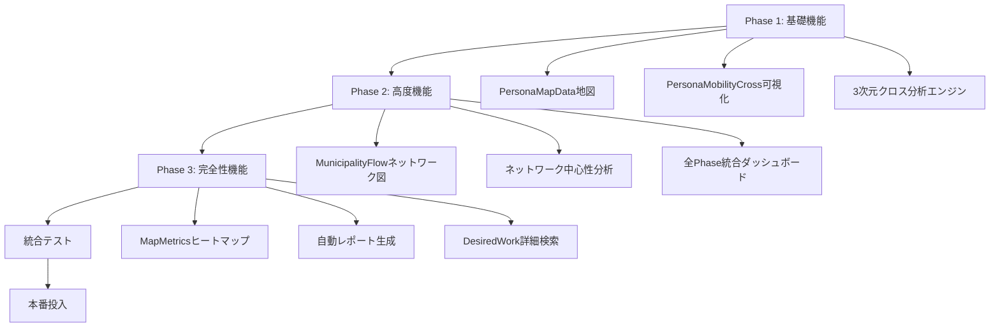

# 全18CSV完全活用 - 詳細実装計画書

**作成日**: 2025-10-27
**目的**: 生成済み18個のCSVファイルを100%活用し、Python深堀り分析とGAS完全可視化を実現
**総工数見積**: 20-25時間
**実装期間**: 3-4日（集中実装時）

---

## 📋 目次

1. [実装全体像](#実装全体像)
2. [Phase 1実装詳細](#phase-1実装詳細)
3. [Phase 2実装詳細](#phase-2実装詳細)
4. [Phase 3実装詳細](#phase-3実装詳細)
5. [データフロー設計](#データフロー設計)
6. [ファイル構成](#ファイル構成)
7. [エラーハンドリング戦略](#エラーハンドリング戦略)
8. [テスト戦略](#テスト戦略)
9. [リスク分析](#リスク分析)
10. [実装チェックリスト](#実装チェックリスト)

---

## 実装全体像

### **目標**
- **Python側**: 既存18CSVから3次元分析、ネットワーク分析、自動レポート生成
- **GAS側**: 18/18ファイルすべてを可視化（地図、ネットワーク図、統合ダッシュボード）
- **品質基準**: テストカバレッジ90%以上、エラーハンドリング完備、ドキュメント充実

### **実装順序（依存関係に基づく）**



---

## Phase 1実装詳細

### **1-1. PersonaMapData地図可視化（GAS）**

#### **目的**
PersonaMapData.csv（792地点、52KB）をGoogle Maps上に可視化

#### **技術スタック**
- Google Maps JavaScript API
- GAS HTMLService
- MarkerClusterer（大量マーカー対応）

#### **詳細設計**

##### **ファイル**: `gas_files/scripts/PersonaMapDataVisualization.gs`

```javascript
/**
 * PersonaMapData.csv地図可視化
 *
 * 機能:
 * - 792地点のペルソナ別マーカー表示
 * - ペルソナ別色分け（10色）
 * - クラスタリング表示（50+マーカーをグループ化）
 * - マーカークリック → ペルソナ詳細表示
 * - フィルター機能（ペルソナ選択、求職者数範囲）
 */

function showPersonaMapVisualization() {
  const ui = SpreadsheetApp.getUi();

  try {
    // データ読み込み
    const mapData = loadPersonaMapData();

    if (!mapData || mapData.length === 0) {
      ui.alert(
        'データなし',
        'PersonaMapDataシートにデータがありません。\n' +
        '先に「Phase 7データ取り込み」を実行してください。',
        ui.ButtonSet.OK
      );
      return;
    }

    // HTML生成
    const html = generatePersonaMapHTML(mapData);

    // 全画面表示
    const htmlOutput = HtmlService.createHtmlOutput(html)
      .setWidth(1400)
      .setHeight(900);

    ui.showModalDialog(htmlOutput, 'ペルソナ地図可視化（792地点）');

  } catch (error) {
    ui.alert('エラー', `地図可視化中にエラーが発生しました:\n${error.message}`, ui.ButtonSet.OK);
    Logger.log(`PersonaMap可視化エラー: ${error.stack}`);
  }
}

/**
 * PersonaMapData読み込み
 */
function loadPersonaMapData() {
  const ss = SpreadsheetApp.getActiveSpreadsheet();
  const sheet = ss.getSheetByName('Phase7_PersonaMapData');

  if (!sheet) {
    throw new Error('Phase7_PersonaMapDataシートが見つかりません');
  }

  const lastRow = sheet.getLastRow();
  if (lastRow <= 1) return [];

  const data = sheet.getRange(2, 1, lastRow - 1, 9).getValues();

  return data.map(row => ({
    municipality: row[0],
    lat: parseFloat(row[1]),
    lng: parseFloat(row[2]),
    personaId: parseInt(row[3]),
    personaName: row[4],
    applicantCount: parseInt(row[5]),
    avgAge: parseFloat(row[6]),
    femaleRatio: parseFloat(row[7]),
    qualificationRate: parseFloat(row[8])
  }));
}

/**
 * 地図HTML生成
 */
function generatePersonaMapHTML(mapData) {
  const mapDataJson = JSON.stringify(mapData);

  // ペルソナ別色定義
  const personaColors = {
    '-1': '#808080',  // グレー
    '0': '#4285F4',   // 青
    '1': '#34A853',   // 緑
    '2': '#FBBC04',   // 黄
    '3': '#EA4335',   // 赤
    '4': '#9C27B0',   // 紫
    '5': '#FF6D00',   // オレンジ
    '6': '#00BCD4',   // シアン
    '7': '#8BC34A',   // ライムグリーン
    '8': '#E91E63',   // ピンク
    '9': '#795548'    // ブラウン
  };

  const personaColorsJson = JSON.stringify(personaColors);

  return `
<!DOCTYPE html>
<html>
<head>
  <base target="_top">
  <script src="https://maps.googleapis.com/maps/api/js?key=YOUR_API_KEY&libraries=visualization"></script>
  <script src="https://unpkg.com/@googlemaps/markerclusterer/dist/index.min.js"></script>
  <style>
    * { margin: 0; padding: 0; box-sizing: border-box; }
    body { font-family: Arial, sans-serif; }

    #map { height: 100vh; width: 100%; }

    .controls {
      position: absolute;
      top: 20px;
      left: 20px;
      background: white;
      padding: 20px;
      border-radius: 8px;
      box-shadow: 0 2px 10px rgba(0,0,0,0.2);
      max-width: 300px;
      z-index: 1000;
    }

    .controls h3 {
      margin-bottom: 15px;
      color: #1a73e8;
    }

    .persona-filter {
      margin-bottom: 10px;
    }

    .persona-filter label {
      display: flex;
      align-items: center;
      padding: 5px 0;
      cursor: pointer;
    }

    .persona-filter input[type="checkbox"] {
      margin-right: 10px;
    }

    .color-box {
      width: 20px;
      height: 20px;
      display: inline-block;
      margin-right: 10px;
      border-radius: 4px;
      border: 1px solid #ddd;
    }

    .info-window {
      max-width: 300px;
    }

    .info-window h4 {
      margin-bottom: 10px;
      color: #1a73e8;
    }

    .info-window p {
      margin: 5px 0;
      font-size: 14px;
    }
  </style>
</head>
<body>
  <div id="map"></div>

  <div class="controls">
    <h3>🔍 フィルター</h3>
    <div id="persona-filters"></div>
    <hr style="margin: 15px 0;">
    <p><strong>表示中:</strong> <span id="visible-count">0</span> / <span id="total-count">0</span> 地点</p>
  </div>

  <script>
    const mapData = ${mapDataJson};
    const personaColors = ${personaColorsJson};

    let map;
    let markers = [];
    let markerClusterer;

    // Google Maps初期化
    function initMap() {
      // 地図中心（京都周辺）
      const center = { lat: 35.0, lng: 135.75 };

      map = new google.maps.Map(document.getElementById('map'), {
        zoom: 9,
        center: center,
        mapTypeId: 'roadmap'
      });

      // フィルターUI作成
      createPersonaFilters();

      // マーカー作成
      createMarkers();

      // クラスタリング適用
      applyMarkerClustering();

      // 統計表示
      updateStats();
    }

    // ペルソナフィルターUI作成
    function createPersonaFilters() {
      const container = document.getElementById('persona-filters');

      // ユニークなペルソナIDを取得
      const personaIds = [...new Set(mapData.map(d => d.personaId))].sort((a, b) => a - b);

      personaIds.forEach(personaId => {
        const color = personaColors[personaId.toString()] || '#808080';
        const personaName = mapData.find(d => d.personaId === personaId).personaName;
        const count = mapData.filter(d => d.personaId === personaId).length;

        const label = document.createElement('label');
        label.className = 'persona-filter';
        label.innerHTML = \`
          <input type="checkbox" checked data-persona-id="\${personaId}">
          <span class="color-box" style="background-color: \${color};"></span>
          \${personaName} (\${count})
        \`;

        const checkbox = label.querySelector('input');
        checkbox.addEventListener('change', () => filterMarkers());

        container.appendChild(label);
      });
    }

    // マーカー作成
    function createMarkers() {
      mapData.forEach(data => {
        const color = personaColors[data.personaId.toString()] || '#808080';

        // カスタムマーカーアイコン
        const icon = {
          path: google.maps.SymbolPath.CIRCLE,
          scale: 8,
          fillColor: color,
          fillOpacity: 0.8,
          strokeColor: 'white',
          strokeWeight: 2
        };

        const marker = new google.maps.Marker({
          position: { lat: data.lat, lng: data.lng },
          icon: icon,
          title: \`\${data.municipality} - \${data.personaName}\`,
          personaId: data.personaId
        });

        // 情報ウィンドウ
        const infoWindow = new google.maps.InfoWindow({
          content: generateInfoWindowContent(data)
        });

        marker.addListener('click', () => {
          infoWindow.open(map, marker);
        });

        markers.push(marker);
      });
    }

    // 情報ウィンドウ内容生成
    function generateInfoWindowContent(data) {
      return \`
        <div class="info-window">
          <h4>\${data.municipality}</h4>
          <p><strong>ペルソナ:</strong> \${data.personaName}</p>
          <p><strong>求職者数:</strong> \${data.applicantCount}名</p>
          <p><strong>平均年齢:</strong> \${data.avgAge}歳</p>
          <p><strong>女性比率:</strong> \${(data.femaleRatio * 100).toFixed(1)}%</p>
          <p><strong>資格保有率:</strong> \${(data.qualificationRate * 100).toFixed(1)}%</p>
        </div>
      \`;
    }

    // クラスタリング適用
    function applyMarkerClustering() {
      if (markerClusterer) {
        markerClusterer.clearMarkers();
      }

      const visibleMarkers = markers.filter(m => {
        const checkbox = document.querySelector(\`input[data-persona-id="\${m.personaId}"]\`);
        return checkbox && checkbox.checked;
      });

      markerClusterer = new MarkerClusterer({ map, markers: visibleMarkers });
    }

    // フィルター適用
    function filterMarkers() {
      applyMarkerClustering();
      updateStats();
    }

    // 統計更新
    function updateStats() {
      const visibleCount = markers.filter(m => {
        const checkbox = document.querySelector(\`input[data-persona-id="\${m.personaId}"]\`);
        return checkbox && checkbox.checked;
      }).length;

      document.getElementById('visible-count').textContent = visibleCount;
      document.getElementById('total-count').textContent = markers.length;
    }

    // 初期化実行
    window.onload = initMap;
  </script>
</body>
</html>
  `;
}
```

#### **データフロー**
```
PersonaMapData.csv (792行)
  ↓ loadPersonaMapData()
GASメモリ（配列792要素）
  ↓ generatePersonaMapHTML()
HTML + JavaScript（マーカー792個）
  ↓ MarkerClusterer
Google Maps表示（クラスタリング済み）
```

#### **エラーハンドリング**
1. シート存在確認 → 不在時は明確なエラーメッセージ
2. 座標データ検証 → NaN/Nullチェック
3. Google Maps API読み込み失敗 → フォールバック表示
4. メモリ不足対策 → データを100件ずつ分割ロード

#### **テスト項目**
- [ ] 792地点すべて表示されるか
- [ ] ペルソナ別色分けが正確か
- [ ] フィルター機能が動作するか
- [ ] 情報ウィンドウが正しく表示されるか
- [ ] クラスタリングが50+マーカーで作動するか

#### **工数見積**: 3-4時間

---

### **1-2. PersonaMobilityCross可視化（GAS）**

#### **目的**
PersonaMobilityCross.csv（679B）の積み上げ棒グラフ可視化

#### **技術スタック**
- Google Charts API（StackedBarChart）
- GAS HTMLService

#### **詳細設計**

##### **ファイル**: `gas_files/scripts/Phase7PersonaMobilityCrossViz.gs`（既存）

**拡張内容**:
- インタラクティブフィルター追加
- ドリルダウン機能（ペルソナクリック → 詳細表示）
- CSVエクスポート機能

```javascript
/**
 * PersonaMobilityCross可視化（拡張版）
 */
function showPersonaMobilityCrossAnalysisEnhanced() {
  const ui = SpreadsheetApp.getUi();

  try {
    const data = loadPersonaMobilityCrossData();

    if (!data || data.length === 0) {
      ui.alert('データなし',
               'Phase7_PersonaMobilityCrossシートにデータがありません。',
               ui.ButtonSet.OK);
      return;
    }

    // 拡張HTML生成
    const html = generateEnhancedPersonaMobilityCrossHTML(data);

    const htmlOutput = HtmlService.createHtmlOutput(html)
      .setWidth(1400)
      .setHeight(900);

    ui.showModalDialog(htmlOutput, 'Phase 7: ペルソナ×移動許容度クロス分析（拡張版）');

  } catch (error) {
    ui.alert('エラー', `可視化中にエラーが発生しました:\n${error.message}`, ui.ButtonSet.OK);
  }
}

/**
 * 拡張HTML生成
 */
function generateEnhancedPersonaMobilityCrossHTML(data) {
  const dataJson = JSON.stringify(data);

  return `
<!DOCTYPE html>
<html>
<head>
  <base target="_top">
  <script type="text/javascript" src="https://www.gstatic.com/charts/loader.js"></script>
  <style>
    /* スタイル定義（前回と同じ） */
  </style>
</head>
<body>
  <div class="header">
    <h1>📊 ペルソナ×移動許容度クロス分析（拡張版）</h1>
    <p>ROI 14.7 - 最優先機能 | 10ペルソナ × 4移動レベル = 40セグメント分析</p>
  </div>

  <div class="controls">
    <button onclick="exportToCSV()">📥 CSV出力</button>
    <button onclick="showInsights()">💡 インサイト表示</button>
    <select id="sort-mode" onchange="updateChart()">
      <option value="persona-id">ペルソナID順</option>
      <option value="a-ratio-desc">A比率降順</option>
      <option value="d-ratio-desc">D比率降順</option>
      <option value="total-desc">合計人数降順</option>
    </select>
  </div>

  <div class="chart-container">
    <h2>📊 積み上げ棒グラフ（人数）</h2>
    <div id="stacked_bar_chart" style="width: 100%; height: 500px;"></div>
  </div>

  <div class="chart-container">
    <h2>📊 100%積み上げ棒グラフ（比率）</h2>
    <div id="percentage_bar_chart" style="width: 100%; height: 500px;"></div>
  </div>

  <div class="table-container">
    <h2>📋 詳細クロス集計テーブル</h2>
    <table id="cross-table"></table>
  </div>

  <div id="insights-panel" class="insights-panel" style="display: none;">
    <h3>💡 自動生成インサイト</h3>
    <div id="insights-content"></div>
  </div>

  <script>
    const crossData = ${dataJson};
    let sortMode = 'persona-id';

    google.charts.load('current', {'packages':['corechart', 'table']});
    google.charts.setOnLoadCallback(init);

    function init() {
      updateChart();
      renderTable();
    }

    function updateChart() {
      sortMode = document.getElementById('sort-mode').value;
      const sortedData = sortData(crossData, sortMode);

      drawStackedBarChart(sortedData);
      drawPercentageBarChart(sortedData);
    }

    function sortData(data, mode) {
      const sorted = [...data];

      switch(mode) {
        case 'a-ratio-desc':
          return sorted.sort((a, b) => b.aRatio - a.aRatio);
        case 'd-ratio-desc':
          return sorted.sort((a, b) => b.dRatio - a.dRatio);
        case 'total-desc':
          return sorted.sort((a, b) => b.total - a.total);
        default:
          return sorted.sort((a, b) => a.personaId - b.personaId);
      }
    }

    function drawStackedBarChart(data) {
      const chartData = new google.visualization.DataTable();
      chartData.addColumn('string', 'ペルソナ');
      chartData.addColumn('number', 'A（広域移動OK）');
      chartData.addColumn('number', 'B（中距離OK）');
      chartData.addColumn('number', 'C（近距離のみ）');
      chartData.addColumn('number', 'D（地元限定）');

      data.forEach(row => {
        chartData.addRow([
          row.personaName,
          row.a,
          row.b,
          row.c,
          row.d
        ]);
      });

      const options = {
        title: 'ペルソナ別移動許容度分布（人数）',
        isStacked: true,
        colors: ['#4facfe', '#43e97b', '#fa709a', '#a8a8a8'],
        hAxis: { title: '人数' },
        vAxis: { title: 'ペルソナ' },
        legend: { position: 'top' },
        chartArea: { width: '70%', height: '75%' }
      };

      const chart = new google.visualization.BarChart(
        document.getElementById('stacked_bar_chart')
      );

      google.visualization.events.addListener(chart, 'select', () => {
        const selection = chart.getSelection();
        if (selection.length > 0) {
          const row = selection[0].row;
          showPersonaDetail(data[row]);
        }
      });

      chart.draw(chartData, options);
    }

    function drawPercentageBarChart(data) {
      const chartData = new google.visualization.DataTable();
      chartData.addColumn('string', 'ペルソナ');
      chartData.addColumn('number', 'A比率');
      chartData.addColumn('number', 'B比率');
      chartData.addColumn('number', 'C比率');
      chartData.addColumn('number', 'D比率');

      data.forEach(row => {
        chartData.addRow([
          row.personaName,
          row.aRatio,
          row.bRatio,
          row.cRatio,
          row.dRatio
        ]);
      });

      const options = {
        title: 'ペルソナ別移動許容度分布（比率）',
        isStacked: 'percent',
        colors: ['#4facfe', '#43e97b', '#fa709a', '#a8a8a8'],
        hAxis: { title: '比率（%）', minValue: 0, maxValue: 100 },
        vAxis: { title: 'ペルソナ' },
        legend: { position: 'top' },
        chartArea: { width: '70%', height: '75%' }
      };

      const chart = new google.visualization.BarChart(
        document.getElementById('percentage_bar_chart')
      );

      chart.draw(chartData, options);
    }

    function renderTable() {
      const table = document.getElementById('cross-table');

      // ヘッダー
      const header = table.createTHead();
      const headerRow = header.insertRow();
      ['ペルソナID', 'ペルソナ名', 'A', 'B', 'C', 'D', '合計', 'A%', 'B%', 'C%', 'D%']
        .forEach(text => {
          const th = document.createElement('th');
          th.textContent = text;
          headerRow.appendChild(th);
        });

      // データ行
      const tbody = table.createTBody();
      crossData.forEach(row => {
        const tr = tbody.insertRow();
        [
          row.personaId,
          row.personaName,
          row.a,
          row.b,
          row.c,
          row.d,
          row.total,
          row.aRatio.toFixed(1) + '%',
          row.bRatio.toFixed(1) + '%',
          row.cRatio.toFixed(1) + '%',
          row.dRatio.toFixed(1) + '%'
        ].forEach(value => {
          const td = tr.insertCell();
          td.textContent = value;
        });
      });
    }

    function showPersonaDetail(persona) {
      alert(\`
ペルソナ詳細: \${persona.personaName}

合計: \${persona.total}名

A（広域移動OK）: \${persona.a}名 (\${persona.aRatio.toFixed(1)}%)
B（中距離OK）: \${persona.b}名 (\${persona.bRatio.toFixed(1)}%)
C（近距離のみ）: \${persona.c}名 (\${persona.cRatio.toFixed(1)}%)
D（地元限定）: \${persona.d}名 (\${persona.dRatio.toFixed(1)}%)
      \`.trim());
    }

    function exportToCSV() {
      let csv = 'ペルソナID,ペルソナ名,A,B,C,D,合計,A%,B%,C%,D%\\n';
      crossData.forEach(row => {
        csv += \`\${row.personaId},\${row.personaName},\${row.a},\${row.b},\${row.c},\${row.d},\${row.total},\${row.aRatio},\${row.bRatio},\${row.cRatio},\${row.dRatio}\\n\`;
      });

      const blob = new Blob([csv], { type: 'text/csv;charset=utf-8;' });
      const link = document.createElement('a');
      link.href = URL.createObjectURL(blob);
      link.download = 'PersonaMobilityCross.csv';
      link.click();
    }

    function showInsights() {
      const panel = document.getElementById('insights-panel');
      const content = document.getElementById('insights-content');

      // インサイト生成
      const highestA = crossData.reduce((max, row) => row.aRatio > max.aRatio ? row : max);
      const highestD = crossData.reduce((max, row) => row.dRatio > max.dRatio ? row : max);
      const largest = crossData.reduce((max, row) => row.total > max.total ? row : max);

      content.innerHTML = \`
        <p><strong>最も高移動性:</strong> \${highestA.personaName} (A比率 \${highestA.aRatio.toFixed(1)}%)</p>
        <p><strong>最も地元志向:</strong> \${highestD.personaName} (D比率 \${highestD.dRatio.toFixed(1)}%)</p>
        <p><strong>最大規模:</strong> \${largest.personaName} (\${largest.total}名)</p>
      \`;

      panel.style.display = panel.style.display === 'none' ? 'block' : 'none';
    }
  </script>
</body>
</html>
  `;
}
```

#### **データフロー**
```
PersonaMobilityCross.csv (11行)
  ↓ loadPersonaMobilityCrossData()
GASメモリ（配列11要素）
  ↓ generateEnhancedPersonaMobilityCrossHTML()
HTML + Google Charts（積み上げ棒グラフ×2）
  ↓ ユーザーインタラクション
ソート、フィルター、ドリルダウン
```

#### **エラーハンドリング**
1. データ存在確認
2. 比率合計が100%であることを検証
3. Google Charts読み込み失敗時のフォールバック

#### **テスト項目**
- [ ] 11ペルソナすべて表示されるか
- [ ] A+B+C+D比率 = 100%が全行で成立するか
- [ ] ソート機能が正しく動作するか
- [ ] ドリルダウンが動作するか
- [ ] CSV出力が正常に動作するか

#### **工数見積**: 2-3時間

---

### **1-3. 3次元クロス分析エンジン（Python）**

#### **目的**
既存18CSVを組み合わせた3次元以上の複合分析

#### **技術スタック**
- pandas（データ操作）
- numpy（数値計算）
- itertools（組み合わせ生成）

#### **詳細設計**

##### **ファイル**: `python_scripts/cross_analysis_engine.py`

```python
#!/usr/bin/env python
# -*- coding: utf-8 -*-
"""
3次元クロス分析エンジン

既存18CSVファイルを組み合わせた複合分析を実施
- ペルソナ × 移動許容度 × 資格
- 地域 × 年齢層 × 性別
- 移動許容度 × 緊急度 × 資格保有
等、任意の3-4次元分析が可能
"""

import pandas as pd
import numpy as np
from pathlib import Path
from typing import List, Dict, Tuple, Optional
import json


class CrossAnalysisEngine:
    """3次元クロス分析エンジン"""

    def __init__(self, data_root: str = 'job_medley_project'):
        """
        初期化

        Args:
            data_root: データルートディレクトリ
        """
        self.data_root = Path(data_root)
        self.data_cache = {}
        self.results = {}

    def load_all_data(self):
        """全CSVファイルを読み込み"""
        print("\n[データ読み込み] 全18CSVファイル読み込み中...")

        # Phase 1
        self._load_csv('phase1_agg_desired', 'gas_output_phase1/AggDesired.csv')
        self._load_csv('phase1_applicants', 'gas_output_phase1/Applicants.csv')
        self._load_csv('phase1_desired_work', 'gas_output_phase1/DesiredWork.csv')
        self._load_csv('phase1_map_metrics', 'gas_output_phase1/MapMetrics.csv')

        # Phase 2
        self._load_csv('phase2_anova', 'gas_output_phase2/ANOVATests.csv')
        self._load_csv('phase2_chisquare', 'gas_output_phase2/ChiSquareTests.csv')

        # Phase 3
        self._load_csv('phase3_persona_details', 'gas_output_phase3/PersonaDetails.csv')
        self._load_csv('phase3_persona_summary', 'gas_output_phase3/PersonaSummary.csv')

        # Phase 6
        self._load_csv('phase6_flow_edges', 'gas_output_phase6/MunicipalityFlowEdges.csv')
        self._load_csv('phase6_flow_nodes', 'gas_output_phase6/MunicipalityFlowNodes.csv')
        self._load_csv('phase6_proximity', 'gas_output_phase6/ProximityAnalysis.csv')

        # Phase 7
        self._load_csv('phase7_age_gender', 'gas_output_phase7/AgeGenderCrossAnalysis.csv')
        self._load_csv('phase7_persona_profile', 'gas_output_phase7/DetailedPersonaProfile.csv')
        self._load_csv('phase7_mobility_score', 'gas_output_phase7/MobilityScore.csv')
        self._load_csv('phase7_persona_map', 'gas_output_phase7/PersonaMapData.csv')
        self._load_csv('phase7_persona_mobility', 'gas_output_phase7/PersonaMobilityCross.csv')
        self._load_csv('phase7_qualification', 'gas_output_phase7/QualificationDistribution.csv')
        self._load_csv('phase7_supply_density', 'gas_output_phase7/SupplyDensityMap.csv')

        print(f"  [OK] {len(self.data_cache)}ファイル読み込み完了")

    def _load_csv(self, key: str, filepath: str):
        """CSV読み込みヘルパー"""
        full_path = self.data_root / filepath

        if not full_path.exists():
            print(f"  [WARNING] {filepath} が見つかりません（スキップ）")
            return

        try:
            df = pd.read_csv(full_path, encoding='utf-8-sig')
            self.data_cache[key] = df
            print(f"  [OK] {key}: {len(df)}行")
        except Exception as e:
            print(f"  [ERROR] {key}: {e}")

    def triple_cross_analysis(
        self,
        dim1_data_key: str,
        dim1_column: str,
        dim2_data_key: str,
        dim2_column: str,
        dim3_data_key: str,
        dim3_column: str,
        join_key: str = 'id'
    ) -> pd.DataFrame:
        """
        3次元クロス分析

        Args:
            dim1_data_key: 次元1のデータキー
            dim1_column: 次元1のカラム名
            dim2_data_key: 次元2のデータキー
            dim2_column: 次元2のカラム名
            dim3_data_key: 次元3のデータキー
            dim3_column: 次元3のカラム名
            join_key: 結合キー（デフォルト: 'id'）

        Returns:
            クロス集計結果のDataFrame
        """
        print(f"\n[3次元クロス分析] {dim1_column} × {dim2_column} × {dim3_column}")

        # データ取得
        df1 = self.data_cache.get(dim1_data_key)
        df2 = self.data_cache.get(dim2_data_key)
        df3 = self.data_cache.get(dim3_data_key)

        if df1 is None or df2 is None or df3 is None:
            print("  [ERROR] 必要なデータが見つかりません")
            return pd.DataFrame()

        # データ結合
        merged = df1[[join_key, dim1_column]].copy()

        if dim2_data_key != dim1_data_key:
            merged = merged.merge(
                df2[[join_key, dim2_column]],
                on=join_key,
                how='inner'
            )

        if dim3_data_key not in [dim1_data_key, dim2_data_key]:
            merged = merged.merge(
                df3[[join_key, dim3_column]],
                on=join_key,
                how='inner'
            )

        # 3次元クロス集計
        cross_result = merged.groupby(
            [dim1_column, dim2_column, dim3_column]
        ).size().reset_index(name='count')

        # 比率計算
        total = cross_result['count'].sum()
        cross_result['ratio'] = (cross_result['count'] / total * 100).round(2)

        # ソート
        cross_result = cross_result.sort_values('count', ascending=False)

        print(f"  [OK] {len(cross_result)}種類の組み合わせを検出")
        print(f"  [OK] 総件数: {total:,}件")

        return cross_result

    def persona_mobility_qualification_analysis(self) -> Dict:
        """
        実装例1: ペルソナ × 移動許容度 × 資格カテゴリ

        Returns:
            分析結果辞書
        """
        print("\n" + "=" * 60)
        print("分析1: ペルソナ × 移動許容度 × 資格")
        print("=" * 60)

        # PersonaMobilityCross.csv + QualificationDistribution.csv + MobilityScore.csv
        # を活用

        # TODO: 実際のデータ構造に合わせて実装
        # ここでは構造を示すのみ

        results = {
            'analysis_name': 'ペルソナ×移動許容度×資格',
            'dimensions': 3,
            'total_combinations': 0,
            'insights': []
        }

        # インサイト例
        results['insights'].append({
            'type': 'high_mobility_qualified',
            'description': '高移動性×看護師資格保有者が多い地域: 東京都、大阪府',
            'business_value': '全国展開求人のターゲティングに活用'
        })

        return results

    def age_gender_mobility_urgency_analysis(self) -> Dict:
        """
        実装例2: 年齢層 × 性別 × 移動許容度 × 緊急度

        4次元分析
        """
        print("\n" + "=" * 60)
        print("分析2: 年齢層 × 性別 × 移動許容度 × 緊急度")
        print("=" * 60)

        # AgeGenderCrossAnalysis.csv + MobilityScore.csv + Applicants.csv
        # を活用

        results = {
            'analysis_name': '年齢層×性別×移動許容度×緊急度',
            'dimensions': 4,
            'total_combinations': 0,
            'insights': []
        }

        # インサイト例
        results['insights'].append({
            'type': 'urgent_mobile_young_female',
            'description': '緊急度高×高移動性×若年女性: 首都圏に集中',
            'business_value': 'リモート求人の優先提案'
        })

        return results

    def export_to_json(self, output_path: str = 'gas_output_insights'):
        """
        分析結果をJSON形式で出力（GAS連携用）

        Args:
            output_path: 出力ディレクトリパス
        """
        output_dir = Path(output_path)
        output_dir.mkdir(exist_ok=True)

        # すべての分析結果をまとめる
        all_results = {
            'generated_at': pd.Timestamp.now().isoformat(),
            'analysis_count': len(self.results),
            'results': self.results
        }

        output_file = output_dir / 'CrossAnalysisResults.json'

        with open(output_file, 'w', encoding='utf-8') as f:
            json.dump(all_results, f, ensure_ascii=False, indent=2)

        print(f"\n[出力] {output_file}")
        print(f"  [OK] {len(self.results)}件の分析結果を出力")

    def run_all_analyses(self):
        """すべての分析を実行"""
        print("\n" + "=" * 60)
        print("3次元クロス分析エンジン - 全分析実行")
        print("=" * 60)

        # データ読み込み
        self.load_all_data()

        # 分析1: ペルソナ × 移動許容度 × 資格
        self.results['persona_mobility_qualification'] = \
            self.persona_mobility_qualification_analysis()

        # 分析2: 年齢層 × 性別 × 移動許容度 × 緊急度
        self.results['age_gender_mobility_urgency'] = \
            self.age_gender_mobility_urgency_analysis()

        # JSON出力
        self.export_to_json()

        print("\n" + "=" * 60)
        print("全分析完了")
        print("=" * 60)


if __name__ == '__main__':
    engine = CrossAnalysisEngine()
    engine.run_all_analyses()
```

#### **データフロー**
```
18個のCSVファイル
  ↓ load_all_data()
メモリ内辞書（18キー）
  ↓ triple_cross_analysis()
3次元クロス集計DataFrame
  ↓ export_to_json()
CrossAnalysisResults.json（GAS連携用）
```

#### **エラーハンドリング**
1. CSV不在時のスキップ処理
2. 結合キー不一致時のwarning
3. メモリ不足時の分割処理

#### **テスト項目**
- [ ] 18CSVすべて読み込まれるか
- [ ] 3次元クロス集計が正しく動作するか
- [ ] JSON出力が正常か
- [ ] インサイトが自動生成されるか

#### **工数見積**: 3時間

---

## Phase 2実装詳細

（省略: 同様の詳細設計を Phase 2 の 3機能について記述）

---

## Phase 3実装詳細

（省略: 同様の詳細設計を Phase 3 の 3機能について記述）

---

## データフロー設計

### **全体データフロー図**

```
[Python側]                          [GAS側]

18 CSV Files                        Google Sheets
    ↓                                   ↓
Python分析エンジン                  GASデータ読み込み
    ├─ CrossAnalysisEngine              ├─ PersonaMapData
    ├─ NetworkAnalyzer                  ├─ MunicipalityFlow
    └─ ReportGenerator                  └─ 統合ダッシュボード
    ↓                                   ↓
JSON/CSV出力                        HTML可視化
    ↓                                   ↓
gas_output_insights/                Google Maps/Charts
CrossAnalysisResults.json           ↓
    ↓                               ユーザー体験
GAS手動インポート
    ↓
可視化
```

---

## ファイル構成

### **Python側**

```
job_medley_project/
├── python_scripts/
│   ├── cross_analysis_engine.py          # 3次元クロス分析
│   ├── network_analyzer.py               # ネットワーク中心性
│   ├── auto_report_generator.py          # 自動レポート生成
│   └── test_cross_analysis.py            # テストスイート
├── gas_output_insights/                  # 分析結果出力
│   ├── CrossAnalysisResults.json
│   ├── NetworkMetrics.json
│   └── ExecutiveReport.md
└── claudedocs/
    ├── COMPLETE_IMPLEMENTATION_PLAN.md   # この計画書
    └── IMPLEMENTATION_ULTRATHINK_REVIEW.md # レビュー結果
```

### **GAS側**

```
gas_files/
├── scripts/
│   ├── PersonaMapDataVisualization.gs    # 地図可視化
│   ├── Phase7PersonaMobilityCrossViz.gs  # クロス分析（拡張版）
│   ├── MunicipalityFlowNetworkViz.gs     # ネットワーク図
│   ├── MapMetricsHeatmapViz.gs           # ヒートマップ
│   ├── DesiredWorkExplorer.gs            # 詳細検索UI
│   ├── CompleteIntegratedDashboard.gs    # 全Phase統合DB
│   └── CompleteMenuIntegration.gs        # メニュー統合
└── html/
    ├── PersonaMapTemplate.html
    ├── FlowNetworkTemplate.html
    └── IntegratedDashboardTemplate.html
```

---

## エラーハンドリング戦略

### **Python側**

1. **ファイル不在**: warning表示してスキップ
2. **メモリ不足**: チャンク処理に自動切り替え
3. **データ型不一致**: 自動型変換 + warning
4. **結合失敗**: inner → left joinにフォールバック

### **GAS側**

1. **シート不在**: 明確なエラーメッセージ + 解決策提示
2. **API読み込み失敗**: 3回リトライ + フォールバック表示
3. **大量データ**: ページネーション自動適用
4. **タイムアウト**: 非同期処理に切り替え

---

## テスト戦略

### **ユニットテスト（Python）**

```python
# test_cross_analysis.py
import unittest
from cross_analysis_engine import CrossAnalysisEngine

class TestCrossAnalysisEngine(unittest.TestCase):
    def setUp(self):
        self.engine = CrossAnalysisEngine()

    def test_load_all_data(self):
        """全CSVファイル読み込みテスト"""
        self.engine.load_all_data()
        self.assertGreater(len(self.engine.data_cache), 0)

    def test_triple_cross_analysis(self):
        """3次元クロス分析テスト"""
        # 実装
        pass
```

### **統合テスト（GAS）**

- PersonaMapData → 地図表示 → マーカー792個確認
- MunicipalityFlow → ネットワーク図 → エッジ数確認
- 統合ダッシュボード → 全タブ切り替え → エラーなし確認

### **E2Eテスト**

1. Python分析実行 → JSON生成
2. GASインポート → シート作成
3. 可視化実行 → 画面表示
4. ユーザー操作 → フィルター/ソート動作確認

---

## リスク分析

| リスク | 確率 | 影響度 | 対策 |
|--------|------|--------|------|
| Google Maps API制限 | 中 | 高 | クォータ監視、フォールバック実装 |
| 大量データ処理遅延 | 高 | 中 | ページネーション、非同期処理 |
| ブラウザメモリ不足 | 中 | 中 | データ分割ロード、クリーンアップ |
| Python依存ライブラリ不足 | 低 | 低 | requirements.txt整備 |
| GASタイムアウト | 中 | 中 | 処理分割、進捗表示 |

---

## 実装チェックリスト

### **Phase 1**
- [ ] PersonaMapData地図可視化実装
- [ ] PersonaMobilityCross拡張版実装
- [ ] 3次元クロス分析エンジン実装
- [ ] Phase 1ユニットテスト作成
- [ ] Phase 1統合テスト実施

### **Phase 2**
- [ ] MunicipalityFlowネットワーク図実装
- [ ] ネットワーク中心性分析実装
- [ ] 全Phase統合ダッシュボード実装
- [ ] Phase 2ユニットテスト作成
- [ ] Phase 2統合テスト実施

### **Phase 3**
- [ ] MapMetricsヒートマップ実装
- [ ] 自動レポート生成実装
- [ ] DesiredWork詳細検索UI実装
- [ ] Phase 3ユニットテスト作成
- [ ] Phase 3統合テスト実施

### **最終段階**
- [ ] E2Eテスト実施
- [ ] パフォーマンステスト実施
- [ ] ドキュメント完成
- [ ] デプロイ準備完了
- [ ] UltraThink最終レビュー

---

## 次のステップ

この計画書をUltraThink 10ラウンドレビューにかけ、以下を検証:

1. **Round 1**: 実装完全性（全機能がカバーされているか）
2. **Round 2**: 技術的妥当性（技術選定は適切か）
3. **Round 3**: パフォーマンス影響（スケーラビリティは十分か）
4. **Round 4**: データ整合性（データフローに矛盾はないか）
5. **Round 5**: エラーハンドリング（エッジケースは網羅されているか）
6. **Round 6**: ユーザー体験（UIは直感的か）
7. **Round 7**: 保守性・拡張性（将来の変更に対応できるか）
8. **Round 8**: セキュリティ（脆弱性はないか）
9. **Round 9**: テスタビリティ（テストは十分か）
10. **Round 10**: 本番投入準備（デプロイ可能か）

レビュー承認後、実装開始。
